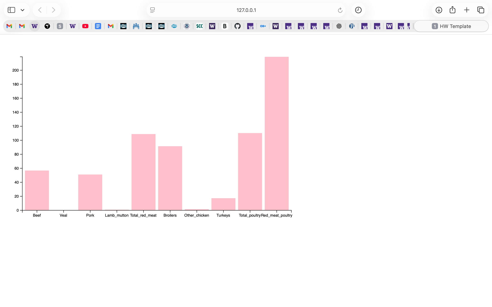

# Samantha Tai's D3 HW

Below you are about to see a bar chart created by me (Samantha) using D3! 
I am using the U.S. Livestock data provided by the USDA. This data shows per capita meat consumption over the years from 2014 to 2025. The graph below is showing the comparison between different meat consumptions. 

relevant citations:
https://ers.usda.gov/sites/default/files/_laserfiche/outlooks/37809/56725_oce-2016-1-d.pdf?v=53323

